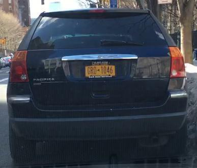
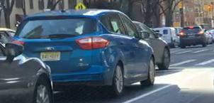

# Anonymization of Dashcam Recordings

## Introduction
In order to be able to use these images in research projects without hesitation, they should be made compliant with data protection laws. Faces as well as vehicle registration plates are to be made unrecognizable for this purpose. In this project, we have worked on the problem of tiny face and vehicle registration plate detection in the image from the dashcam. Our project is capable of detecting the human face and vehicle registration plates in a given image and storing anonymized images. 

## Architecture
The repository is split up into these directories:
* `android-demo/` 
* `python-demo/` 
* `skripts/` skripts for model training

For more information about each directory, please consult the corresponding readme found in each directory.

## Model
Models can be downloaded [here](https://drive.google.com/drive/folders/1W-NS6lsiXtAXFxid3mfYG-0dMdw0ijkg?usp=sharing). Each model contains:
* config and checkpoint file
* saved model for TensorFlow
* .tflite model for TFLite

The necessary model has been included in the repository, so the download is not required.

## Approach
The code follows the steps given below:
* Read the images from a directory.
* Use the first model to detect all objects in the image.
* According to the label, we can filter out the classes that we don't need.
* Merge the overlapped and adjacent boxes.
* Feed each merged box to the second model for detection of human faces and license plates.
* Calculate the detected boxes' location in the original image.
* Blur the corresponding area.

## Results

