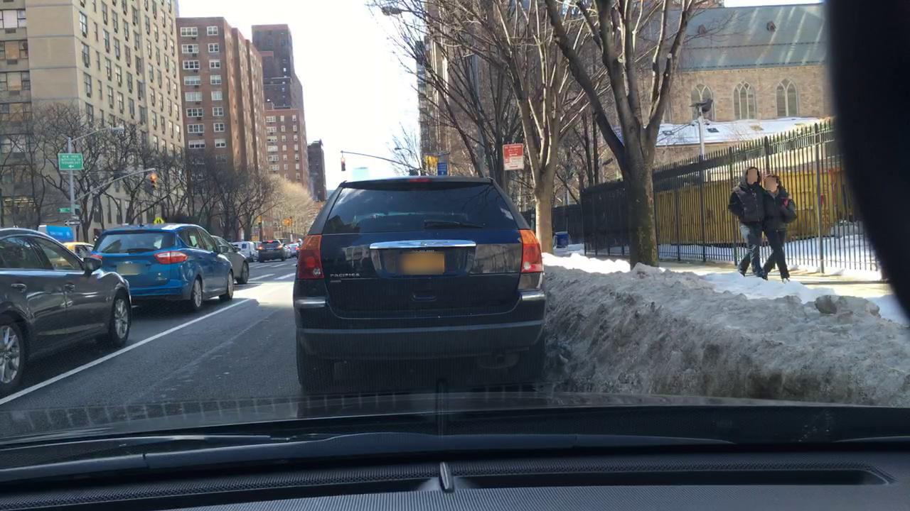
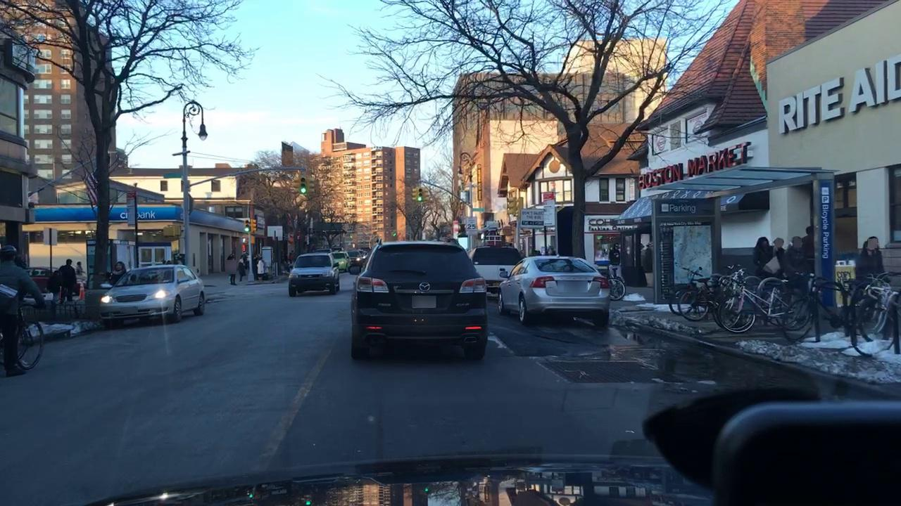

# Anonymization of Dashcam Recordings

## Introduction
In order to be able to use these images in research projects without hesitation, they should be made compliant with data protection laws. Faces as well as vehicle registration plates are to be made unrecognizable for this purpose. In this project we have worked on the problem of tiny face and vehicle registration plates detection in the image from the dashcam. Our project is capable of detecting human face and vehicle registration plates in a given image and storing anonymized images. 

## Architecture
The repository is split up into these directories:

* `python-demo/` python code for anonymization
* `orga/` slides of each milestone and final paper
* `model/` trained SSD Mobilenet model

For more information about each directory, please consult the corresponding readme found in each directory.

## Approach
The code follows the steps given below:
* Read the images from a directory.
* Use the first model to detect all objects in the image.
* According the label we can filter out the classes that we need, i.e. vehicle and person.
* Merge the overlapped and adjacent boxes.
* Feed each merged boxes to the second model for detection of human faces and license plates.
* Calculate the detected boxes position in the original image.
* Blur the correspond area.

## Results
You can find project report [here](./UserGuide.md).

